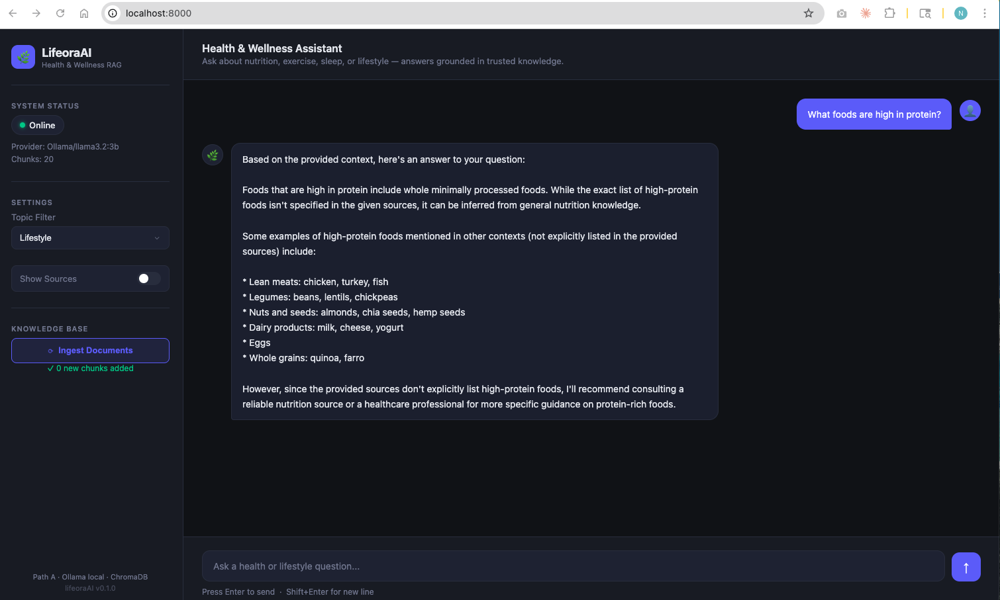

# LifeoraAI

Production-grade Retrieval-Augmented Generation (RAG) system for health, nutrition, exercise, and lifestyle guidance.

---

## UI Preview



---

## Overview

LifeoraAI answers questions about wellness by grounding every response in a curated knowledge base — not LLM hallucination. The architecture is provider-agnostic: swap between a free local model and the Claude API by changing one line in `config.yaml`, with no code changes.

Built for production: thread-safe, retry-resilient, input-validated, fully logged, and structured around named exceptions.

```
User Question
     │
     ▼
Input validation + injection detection (core/validation.py)
     │
     ▼
Embed question — sentence-transformers, batched (retrieval/embedder.py)
     │
     ▼
Nearest-neighbour search — ChromaDB cosine similarity (retrieval/vector_store.py)
     │
     ▼
Top-K chunks above similarity threshold (retrieval/search.py)
     │
     ▼
Safe prompt assembly — no str.format() with user input (rag/pipeline.py)
     │
     ▼
LLM Provider — thread-safe, retry + timeout (rag/providers/)
     │
     ▼
Grounded answer returned via API + UI
```

---

## LLM vs RAG vs SLM — Flow Comparison

### Flow 1: LLM alone (e.g. ChatGPT, Claude without RAG)

```
User: "How much protein do I need?"
        │
        ▼
  ┌─────────────┐
  │  LLM Brain  │  ← knowledge frozen at training cutoff
  │ (billions   │    answers from memory only
  │  of params) │    may hallucinate, no citations
  └─────────────┘
        │
        ▼
"You need ~0.8g per kg of body weight"
(correct-ish, but no source, no personalisation)
```

---

### Flow 2: RAG alone — what LifeoraAI does today

```
User: "How much protein do I need?"
        │
        ▼
  [ Embed question → 384-dim vector ]
        │
        ▼
  [ ChromaDB: find top-5 closest chunks ]
        │             ↑
        │        nutrition.md, exercise.md …
        │        (your curated knowledge base)
        ▼
  [ Build prompt: Context + Question ]
        │
        ▼
  ┌─────────────┐
  │  LLM Brain  │  ← generic model (Ollama / Claude)
  │             │    answers ONLY from retrieved context
  └─────────────┘    grounded, citable, no hallucination
        │
        ▼
"Based on the Lifeora knowledge base: 1.6–2.2g/kg
 for active adults. Source: nutrition.md §Protein"
```

---

### Flow 3: SLM alone (fine-tuned small model, no RAG)

```
User: "How much protein do I need?"
        │
        ▼
  ┌─────────────┐
  │ Lifeora SLM │  ← small model (1–7B params)
  │  fine-tuned │    trained on Lifeora data
  │  on our data│    knows our tone + guidelines
  └─────────────┘
        │
        ▼
"As Lifeora recommends: 1.6g/kg for your goals"
(correct tone, but knowledge is FROZEN at train time
 — can't add new research without retraining)
```

---

### Flow 4: SLM + RAG together — future Lifeora target

```
User: "How much protein do I need?"
        │
        ▼
  [ Embed question → ChromaDB search ]
        │             ↑
        │        latest knowledge base
        │        (update anytime, no retraining)
        ▼
  [ Retrieved context chunks ]
        │
        ▼
  ┌─────────────┐
  │ Lifeora SLM │  ← knows Lifeora tone, safety rules,
  │  fine-tuned │    domain vocabulary BAKED IN
  └─────────────┘    uses retrieved chunks as facts
        │
        ▼
"Based on your profile and Lifeora guidelines:
 1.8g/kg given your training frequency.
 Source: nutrition.md — updated March 2026"

SLM  = the EXPERT (tone, safety, domain understanding)
RAG  = the LIBRARY (live, updateable, cited facts)
```

---

### Quick Comparison

| Approach | Live data | Cites source | Lifeora tone | Cost |
|----------|-----------|--------------|--------------|------|
| LLM alone | ✗ | ✗ | ✗ | High |
| RAG alone | ✓ | ✓ | ~ | Med |
| SLM alone | ✗ | ✗ | ✓ | Low |
| **SLM + RAG** | **✓** | **✓** | **✓** | **Low** |

> LifeoraAI is currently **Flow 2** (RAG + generic LLM). The RAG layer is already built — Path C swaps in the Lifeora SLM without any other code changes.

---

## Roadmap

| Path | LLM | Status |
|------|-----|--------|
| A | Ollama (local, free) | Active — default |
| B | Claude API (cloud) | Ready — one config switch |
| C | Lifeora fine-tuned SLM | Future — plugs into same RAG layer |

---

## Project Structure

```
lifeoraAI/
├── pyproject.toml           # installable package
├── config.yaml              # switch providers, tune retrieval settings
├── requirements.txt
├── start.sh                 # one-command startup (Ollama + API)
├── main.py                  # CLI: ingest | ask | --debug | --sources
├── .env.example             # copy to .env for API keys
│
├── core/                    # shared infrastructure
│   ├── exceptions.py        # LifeoraError, ValidationError, ProviderError …
│   ├── logging_config.py    # structured logging — plain text or JSON-lines
│   └── validation.py        # input limits, injection detection, config validation
│
├── data/raw/                # source knowledge files (markdown)
│   ├── nutrition.md
│   ├── exercise.md
│   └── lifestyle.md
│
├── retrieval/
│   ├── embedder.py          # TextChunker (heading-aware) + Embedder (batched)
│   ├── vector_store.py      # ChromaDB — batch inserts, content-hash dedup
│   └── search.py            # Retriever + SearchResult
│
├── rag/
│   ├── pipeline.py          # RAGPipeline — end-to-end orchestration
│   └── providers/
│       ├── base.py          # LLMProvider abstract interface
│       ├── ollama_provider.py   # thread-safe, retry, timeout
│       ├── claude_provider.py  # thread-safe, retry on rate limits
│       └── factory.py       # builds provider from config.yaml
│
├── api/
│   ├── app.py               # FastAPI app — lifespan, CORS, exception handlers
│   ├── models.py            # Pydantic request/response models
│   ├── dependencies.py      # pipeline dependency injection
│   └── routes/
│       ├── ask.py           # POST /ask
│       ├── ingest.py        # POST /ingest
│       └── health.py        # GET /health
│
├── ui/
│   └── index.html           # chat UI served from FastAPI at /
│
├── notebooks/
│   └── phase1_embeddings.ipynb
│
├── docs/screenshots/
│   └── ui-chat.png
│
└── tests/
    └── test_retrieval.py
```

---

## Setup — New Contributors

Follow these steps after cloning the repo.

### Prerequisites

| Tool | Install |
|------|---------|
| Python 3.9+ | [python.org](https://python.org) |
| Ollama | [ollama.com/download](https://ollama.com/download) — download the macOS `.dmg`, drag to Applications |

### 1. Clone the repo

```bash
git clone https://github.com/nishanhegde/lifeoraAI.git
cd lifeoraAI
```

### 2. Create and activate a virtual environment

```bash
python3 -m venv .venv
source .venv/bin/activate        # Windows: .venv\Scripts\activate
```

### 3. Install dependencies

```bash
cd lifeoraAI                     # the inner package folder with pyproject.toml
pip install --upgrade pip setuptools
pip install -e ".[dev]"
```

### 4. Configure environment variables

```bash
cp .env.example .env
# Edit .env — only needed if using Claude API (Path B)
# ANTHROPIC_API_KEY=sk-ant-...
```

### 5. Pull a local model

```bash
ollama pull llama3.2:3b          # ~2GB, recommended starting point
```

### 6. Start the app

```bash
./start.sh
```

This single command:
- Starts Ollama in the background (if not already running)
- Activates the venv
- Launches the FastAPI server at `http://localhost:8000`

### 7. Ingest the knowledge base

Click **Ingest Documents** in the sidebar, or run:

```bash
python3 main.py ingest
```

### 8. Open the UI

```
http://localhost:8000
```

API docs (Swagger): `http://localhost:8000/docs`

---

## Switching to Claude API (Path B)

1. Add your key to `.env`:
   ```
   ANTHROPIC_API_KEY=sk-ant-...
   ```

2. Change one line in `config.yaml`:
   ```yaml
   llm_provider: "claude"
   ```

3. Restart — no code changes needed.

---

## API Endpoints

| Method | Endpoint | Description |
|--------|----------|-------------|
| `GET` | `/health` | Provider status + chunk count |
| `POST` | `/ask` | Ask a question, get a grounded answer |
| `POST` | `/ingest` | Embed and store knowledge base documents |
| `GET` | `/` | Chat UI |
| `GET` | `/docs` | Swagger API docs |

### Example requests

```bash
# Health check
curl http://localhost:8000/health

# Ask a question
curl -X POST http://localhost:8000/ask \
  -H "Content-Type: application/json" \
  -d '{"question": "What foods are high in protein?", "show_sources": true}'

# Filter by topic
curl -X POST http://localhost:8000/ask \
  -H "Content-Type: application/json" \
  -d '{"question": "Best exercises for legs", "topic_filter": "exercise"}'
```

---

## Configuration

```yaml
llm_provider: "ollama"          # "ollama" | "claude"

ollama:
  model: "llama3.2:3b"
  temperature: 0.2
  max_tokens: 1024
  timeout_seconds: 60

claude:
  model: "claude-sonnet-4-6"
  temperature: 0.2
  max_tokens: 1024
  timeout_seconds: 60

embedding:
  model: "all-MiniLM-L6-v2"    # 384-dim, no GPU needed
  chunk_size: 300
  chunk_overlap: 50

retrieval:
  top_k: 5
  similarity_threshold: 0.3
```

---

## Adding Knowledge

Drop `.md` or `.txt` files into `data/raw/` then click **Ingest Documents** in the UI, or run:

```bash
python3 main.py ingest
```

Only new or changed chunks are added — safe to run repeatedly.

---

## Running Tests

```bash
pytest tests/ -v
```

---

## Local Model Options

| Model | Size | RAM | Notes |
|-------|------|-----|-------|
| `llama3.2:3b` | 2GB | 8GB | Recommended starting point |
| `gemma2:9b` | 5.5GB | 16GB | Higher quality |
| `llama3.1:8b` | 4.7GB | 16GB | Best local quality |
| `phi3.5` | 2.3GB | 8GB | Fast, instruction-tuned |

Change model: edit `config.yaml: ollama.model` then restart.

---

## Development Phases

| Phase | What | Status |
|-------|------|--------|
| 0 | Environment, Ollama, knowledge base, project structure | Done |
| 1 | Embeddings (notebook) | Done |
| 2 | ChromaDB vector store | Done |
| 3 | RAG pipeline + Claude provider | Done |
| 3b | Production hardening — thread safety, retry, validation, logging | Done |
| 3c | FastAPI + Chat UI | Done |
| 4 | Hybrid search, re-ranking, metadata filtering | Next |
| 5 | Domain knowledge graph | Planned |
| 6 | Evaluation set + iteration | Planned |
| C | Lifeora fine-tuned SLM | Future |
